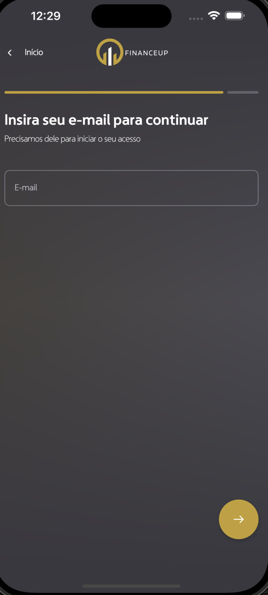

# FinanceUP - App
## FinanceUP | Android | Kotlin | KMP

Welcome to FinanceUP App project! This guide will walk you through setting up the environment to test the project on your local machine.

`Jetpack Compose` & `MVI Architecture` & `KMP`

## 📷 Previews

<p align="center">





</br>
</p>

## 🛠 Structure

This is a Kotlin Multiplatform project targeting Android, iOS.

* `/composeApp` is for code that will be shared across your Compose Multiplatform applications.
  It contains several subfolders:
  - `commonMain` is for code that’s common for all targets.
  - Other folders are for Kotlin code that will be compiled for only the platform indicated in the folder name.
    For example, if you want to use Apple’s CoreCrypto for the iOS part of your Kotlin app,
    `iosMain` would be the right folder for such calls.

* `/iosApp` contains iOS applications. Even if you’re sharing your UI with Compose Multiplatform,
  you need this entry point for your iOS app. This is also where you should add SwiftUI code for your project.

## 🛠 Learn more about

[Kotlin Multiplatform](https://www.jetbrains.com/help/kotlin-multiplatform-dev/get-started.html)…

## 🛠 Tech Stack & Open Source Libraries
- Minimum SDK level 24.
- 100% [Jetpack Compose](https://developer.android.com/jetpack/compose) based + [Coroutines](https://github.com/Kotlin/kotlinx.coroutines) + [Flow](https://kotlin.github.io/kotlinx.coroutines/kotlinx-coroutines-core/kotlinx.coroutines.flow/) for asynchronous.
- Jetpack
  - Compose: Android’s modern toolkit for building native UI.
  - ViewModel: UI related data holder and lifecycle aware.
  - App Startup: Provides a straightforward, performant way to initialize components at application startup.
  - Navigation: For navigating screens and [Koin Compose] for injecting dependencies.
- [Koin]: Dependency Injection.
- [Room]: Local persistence library for managing SQLite databases efficiently and safely, ensuring type safety and seamless database access.

## ✍️ Prerequisites

- Android Studio installed on your machine with Java 17.

## Getting Started

1. **Install Java 17:**

    ```
    https://www.oracle.com/java/technologies/javase/jdk17-archive-downloads.html
    ```

2. **Clone the Repository:**

    ```
    https://github.com/lukesteves92/FinanceUp
    ```

3. **Open Project in Android Studio:**

   Open Android Studio and navigate to `File` > `Open` and select the cloned project directory.

4. **Set Java 17 by Default:**

   Open Android Studio and navigate to `File` > `Settings` > `Build, Execution...` > `Build Tools` > `Gradle` and select the new `Gradle SDK` downloaded, Java 17.

5. **Run the App:**

  - Build and run the FinanceUP in Android Studio.

Congratulations! You have successfully set up the environment to test the FinanceUP project on your local machine. If you encounter any issues, feel free to reach out for assistance. Enjoy!
